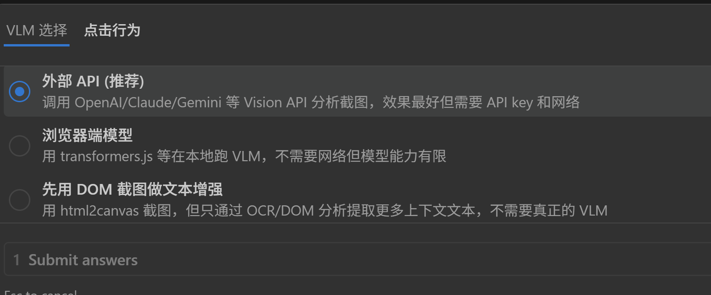

# Bug Report: Duplicate Lightning Buttons on Upload Fields

**Date:** February 7, 2026
**Severity:** Medium (UI/UX bug)
**File:** `src/content.ts`
**Symptom:** Multiple lightning (⚡) buttons appear next to a single upload field, and each button produces different file suggestions.

---

## Table of Contents

1. [Bug Description](#bug-description)
2. [How the System Works (Overview)](#how-the-system-works-overview)
3. [Code Walkthrough](#code-walkthrough)
   - [Step 1: Entry Point — scanAndInject()](#step-1-entry-point--scanandinject)
   - [Step 2: Detection — findUploadTargets()](#step-2-detection--finduploadtargets)
   - [Step 3: Deduplication Guards](#step-3-deduplication-guards)
   - [Step 4: Button Creation and Positioning](#step-4-button-creation-and-positioning)
   - [Step 5: MutationObserver — Continuous Re-scanning](#step-5-mutationobserver--continuous-re-scanning)
4. [Key Data Structures](#key-data-structures)
5. [Why Different Buttons Give Different Suggestions](#why-different-buttons-give-different-suggestions)
6. [Areas to Investigate](#areas-to-investigate)

---

## Bug Description

On pages with file upload fields, the extension injects **multiple** ⚡ buttons for what appears to be a single upload area. See screenshot:



For the "Resume" upload area, there are **3 lightning buttons** visible instead of 1. Each button, when clicked, opens a recommendation panel with **different file suggestions**. This happens because each button was created with a different `UploadTarget` object (different `anchor` element and different `context` text), so they query the backend with different context strings.

---

## How the System Works (Overview)

The content script (`src/content.ts`) runs on every webpage and does the following:

1. **Scans** the page for upload-related elements (file inputs, upload buttons, etc.)
2. **Creates** an `UploadTarget` object for each detected element
3. **Injects** a ⚡ button next to each target
4. **Watches** for DOM changes via `MutationObserver` and re-scans

The bug is in step 1–3: the detection logic finds **multiple elements** that all relate to the same upload field, and the deduplication logic fails to consolidate them into a single button.

---

## Code Walkthrough

### Step 1: Entry Point — scanAndInject()

**File:** `src/content.ts`, lines 1119–1131

```typescript
function scanAndInject() {
  const targets = findUploadTargets();
  for (const target of targets) {
    if (processed.has(target.anchor)) continue;
    processed.add(target.anchor);

    const btn = createButton(target);
    btn.style.zIndex = "2147483646";
    document.body.appendChild(btn);
    positionButton(btn, target.anchor);
    buttonTargets.set(btn, target);
  }
}
```

**What it does:**
- Calls `findUploadTargets()` to get a list of upload-related elements on the page.
- For each target, checks if `target.anchor` was already processed (via the `processed` WeakSet).
- If not processed, creates a ⚡ button, appends it to `document.body`, positions it next to the anchor, and records the mapping.

**Key point:** Deduplication is based on `target.anchor` — the specific DOM element. If two targets have **different** anchor elements (e.g., the `<input type="file">` and a "Select file" `<button>`), they will **both** get a ⚡ button, even if they represent the same upload field.

---

### Step 2: Detection — findUploadTargets()

**File:** `src/content.ts`, lines 39–110

This is the core detection function. It has **two passes**:

#### Pass 1: Standard `<input type="file">` elements (lines 43–56)

```typescript
// 1. Standard visible <input type="file">
document
  .querySelectorAll<HTMLInputElement>('input[type="file"]')
  .forEach((input) => {
    if (processed.has(input)) return;
    // If the input is visible, use it directly
    if (isVisible(input)) {
      targets.push({
        anchor: input,
        fileInput: input,
        context: extractContext(input),
        accept: input.accept || undefined,
      });
    }
  });
```

Finds all `<input type="file">` elements that are visible. Each visible file input becomes a target with itself as the `anchor`.

#### Pass 2: Custom upload buttons (lines 65–107)

```typescript
// 2. Custom upload buttons: buttons/links with upload text that trigger hidden file inputs
const buttons = document.querySelectorAll<HTMLElement>(
  'button, a, [role="button"], label[for], .upload-btn, [class*="upload"], [class*="Upload"]',
);
buttons.forEach((btn) => {
  if (processed.has(btn)) return;
  if (targetedAnchors.has(btn)) return;
  const text = btn.textContent || "";
  if (!UPLOAD_KEYWORDS.test(text)) return;
  // Skip if we already processed this area
  if (btn.querySelector(`.${BUTTON_CLASS}`)) return;
  if (btn.closest(`.${PANEL_CLASS}`)) return;

  // Try to find a nearby hidden file input
  const fileInput = findNearbyFileInput(btn);

  // Skip if the nearby file input is already targeted by a standard detection
  if (fileInput && targetedInputs.has(fileInput)) return;

  // Skip if there's already a visible file input nearby that we're handling
  if (!fileInput) {
    const parent =
      btn.closest("form, fieldset, div, section, tr, li") ||
      btn.parentElement;
    if (parent) {
      const nearbyVisibleInput =
        parent.querySelector<HTMLInputElement>('input[type="file"]');
      if (
        nearbyVisibleInput &&
        (targetedInputs.has(nearbyVisibleInput) ||
          targetedAnchors.has(nearbyVisibleInput))
      )
        return;
    }
  }

  targets.push({
    anchor: btn,
    fileInput,
    context: extractContextFromElement(btn),
    accept: fileInput?.accept || undefined,
  });
});
```

This pass looks for **any element matching a broad CSS selector** whose text contains upload-related keywords (the `UPLOAD_KEYWORDS` regex). The selector is:

```
'button, a, [role="button"], label[for], .upload-btn, [class*="upload"], [class*="Upload"]'
```

**This is very broad.** It matches:
- All `<button>` elements
- All `<a>` elements
- Any element with `role="button"`
- Any `<label>` with a `for` attribute
- Any element with class containing "upload" or "Upload"

**The UPLOAD_KEYWORDS regex:**

```typescript
const UPLOAD_KEYWORDS =
  /upload|browse|choose file|select file|上传|选择文件|附件|attach/i;
```

**Critical issue:** The keyword check uses `btn.textContent`, which includes **all nested text content**, not just direct text. If a parent `<div class="upload-section">` contains the word "upload" in any child, the div itself could match. And a child `<button>Select file</button>` inside it would also match. Both become separate targets.

---

### Step 3: Deduplication Guards

The code has several deduplication mechanisms, but they have gaps:

#### Guard A: `processed` WeakSet (line 17, used at lines 46, 69, 1122)

```typescript
const processed = new WeakSet<Element>();
```

Tracks elements that already have a ⚡ button. Used in both `findUploadTargets()` and `scanAndInject()`.

**Gap:** Only checks `target.anchor`. If the same upload field is represented by **different anchor elements** (e.g., an `<input>`, a `<button>`, and a `<div class="upload-wrapper">`), each gets through because they are different DOM elements.

#### Guard B: `targetedAnchors` / `targetedInputs` sets (lines 59–62)

```typescript
const targetedAnchors = new Set<Element>(targets.map((t) => t.anchor));
const targetedInputs = new Set<Element>(
  targets.filter((t) => t.fileInput).map((t) => t.fileInput!),
);
```

Built after Pass 1. Used in Pass 2 to skip buttons whose nearby file input was already found in Pass 1.

**Gap:** Only checks if the **exact same `<input type="file">`** was already targeted. If `findNearbyFileInput()` returns `null` for a custom button (because the file input is too far away in the DOM), the button bypasses this guard entirely.

#### Guard C: "nearby visible input" check (lines 85–98)

```typescript
if (!fileInput) {
  const parent =
    btn.closest("form, fieldset, div, section, tr, li") ||
    btn.parentElement;
  if (parent) {
    const nearbyVisibleInput =
      parent.querySelector<HTMLInputElement>('input[type="file"]');
    if (
      nearbyVisibleInput &&
      (targetedInputs.has(nearbyVisibleInput) ||
        targetedAnchors.has(nearbyVisibleInput))
    )
      return;
  }
}
```

If `findNearbyFileInput` returns null, this checks the nearest container for a file input that's already handled.

**Gap:** The `btn.closest("form, fieldset, div, section, tr, li")` call finds the **nearest** matching ancestor. If the upload area is wrapped in multiple nested `<div>` elements, a deeply nested button may find a different (smaller) container than a less-nested button, and that smaller container might not contain the file input.

---

### Step 4: Button Creation and Positioning

**File:** `src/content.ts`, lines 201–215 (createButton), lines 1099–1106 (positionButton)

```typescript
function createButton(target: UploadTarget): HTMLButtonElement {
  const btn = document.createElement("button");
  btn.type = "button";
  btn.className = BUTTON_CLASS;
  btn.textContent = "\u26A1";  // ⚡
  btn.title = "xUpload: Smart file recommendation";

  btn.addEventListener("click", (e) => {
    e.preventDefault();
    e.stopPropagation();
    handleRecommend(target, btn);
  });

  return btn;
}
```

```typescript
function positionButton(btn: HTMLButtonElement, anchor: HTMLElement) {
  const rect = anchor.getBoundingClientRect();
  if (rect.width === 0 && rect.height === 0) return;
  btn.style.position = "fixed";
  btn.style.top = `${rect.top + (rect.height - 28) / 2}px`;
  btn.style.left = `${rect.right + 4}px`;
}
```

Each button is:
- Appended to `document.body` (not inside the upload field)
- Positioned with CSS `position: fixed` to the right of its anchor element
- **Bound to its own `target` object** via the closure in `addEventListener`

**Why different suggestions:** Each ⚡ button captures a different `target` in its click handler. Each target has a different `context` string (extracted from different anchor elements). When clicked, `handleRecommend(target, btn)` sends `target.context` to the background script for matching. Different context = different search query = different file suggestions.

---

### Step 5: MutationObserver — Continuous Re-scanning

**File:** `src/content.ts`, lines 1133–1140

```typescript
scanAndInject();

const observer = new MutationObserver(() => scanAndInject());
observer.observe(document.body, { childList: true, subtree: true });

window.addEventListener("scroll", repositionAllButtons, { passive: true });
window.addEventListener("resize", repositionAllButtons, { passive: true });
```

`scanAndInject()` runs:
1. **Once** immediately when the content script loads
2. **Every time** any DOM mutation occurs (child added/removed anywhere in `<body>`)

**Note:** The `MutationObserver` fires on ANY DOM change, including changes caused by the extension itself (e.g., appending a ⚡ button triggers another scan). The `processed` WeakSet prevents infinite loops, but if the page dynamically changes its upload area (e.g., re-renders a React component), the elements could be new DOM nodes that aren't in `processed` yet, causing duplicate detection.

---

## Key Data Structures

| Name | Type | Purpose |
|------|------|---------|
| `processed` | `WeakSet<Element>` | Tracks anchor elements that already have a ⚡ button. Prevents re-injection for the same element. |
| `buttonTargets` | `Map<HTMLButtonElement, UploadTarget>` | Maps each ⚡ button to its target. Used for repositioning on scroll/resize and cleanup when anchor is removed. |
| `UPLOAD_KEYWORDS` | `RegExp` | `/upload\|browse\|choose file\|select file\|上传\|选择文件\|附件\|attach/i` — Matches upload-related text in buttons. |
| `BUTTON_CLASS` | `string` | `"xupload-btn"` — CSS class for all ⚡ buttons. |
| `PANEL_CLASS` | `string` | `"xupload-panel"` — CSS class for recommendation panels. |

### UploadTarget interface (lines 28–37)

```typescript
interface UploadTarget {
  /** The element we attach the ⚡ button next to */
  anchor: HTMLElement;
  /** The actual <input type="file"> to fill (may be hidden) */
  fileInput: HTMLInputElement | null;
  /** Context text for matching */
  context: string;
  /** Accept filter from the input */
  accept?: string;
}
```

---

## Why Different Buttons Give Different Suggestions

Each ⚡ button is bound to a specific `UploadTarget` object. The recommendation flow is:

1. User clicks ⚡ → calls `handleRecommend(target, btn)` (line 208–212)
2. `handleRecommend` sends `target.context` to the background script
3. Background performs text matching against indexed files using `target.context` as the query
4. Results are returned and displayed in a panel

Since each duplicate button has a different `anchor`, `extractContext()` or `extractContextFromElement()` produces a **different context string** for each. The context extraction functions (lines 152–197) collect text from labels, aria attributes, and surrounding containers — the text gathered depends entirely on which element is the anchor.

**Example of what likely happens on the "Resume" upload page:**
- Button A: anchor = the `<input type="file">` → context includes label text, parent container text
- Button B: anchor = a `<button>Select file</button>` → context includes the button text + different container text
- Button C: anchor = a `<div class="upload-area">` → context includes all text inside the upload div

---

## Areas to Investigate

1. **The CSS selector in Pass 2 is very broad.** `[class*="upload"]` matches any element whose class contains "upload" at any position (e.g., `class="file-upload-wrapper"`, `class="upload-btn"`, `class="upload-area"`). Multiple nested elements with "upload" in their class will all match.

2. **`findNearbyFileInput()` only walks 3 ancestor levels.** If the real `<input type="file">` is farther away in the DOM tree, the function returns `null`, and the dedup guard (Guard B) is bypassed.

3. **Guard C uses `btn.closest("div")` which matches the nearest `<div>` ancestor.** In deeply nested HTML, different buttons find different "nearest divs" that may or may not contain the file input.

4. **The `processed` WeakSet only tracks anchors, not the underlying file input.** Two different anchors pointing to the same (or no) file input will both pass the guard.

5. **Framework re-renders (React/Vue/etc.)** can replace DOM nodes with new instances. The `processed` WeakSet holds references to old nodes, so new nodes created by re-renders pass all guards again.

6. **`textContent` on Pass 2 includes all descendant text.** A parent container with "Drag your resume here / Select file / Supported file formats: PDF, DOC..." would match `UPLOAD_KEYWORDS` even though it's not a clickable button.

---

## Helper Functions Reference

### findNearbyFileInput() — lines 123–148

```typescript
function findNearbyFileInput(btn: HTMLElement): HTMLInputElement | null {
  // Check inside the button itself
  const inside = btn.querySelector<HTMLInputElement>('input[type="file"]');
  if (inside) return inside;

  // Check siblings
  const parent = btn.parentElement;
  if (parent) {
    const sibling = parent.querySelector<HTMLInputElement>('input[type="file"]');
    if (sibling) return sibling;
  }

  // Check up to 3 ancestor levels
  let ancestor: HTMLElement | null = btn;
  for (let i = 0; i < 3 && ancestor; i++) {
    ancestor = ancestor.parentElement;
    if (ancestor) {
      const found = ancestor.querySelector<HTMLInputElement>('input[type="file"]');
      if (found) return found;
    }
  }

  return null;
}
```

Walks up to 3 levels of ancestors looking for an `<input type="file">`. Returns `null` if none found within that range.

### isVisible() — lines 112–120

```typescript
function isVisible(el: HTMLElement): boolean {
  const style = getComputedStyle(el);
  return (
    style.display !== "none" &&
    style.visibility !== "hidden" &&
    el.offsetWidth > 0 &&
    el.offsetHeight > 0
  );
}
```

Checks if an element is rendered and visible on screen. Used to filter file inputs in Pass 1 (only visible ones get a button directly).

### extractContext() — lines 152–177

```typescript
function extractContext(input: HTMLInputElement): string {
  const parts: string[] = [];

  if (input.id) {
    const label = document.querySelector(`label[for="${input.id}"]`);
    if (label) parts.push(label.textContent || "");
  }
  const parentLabel = input.closest("label");
  if (parentLabel) parts.push(parentLabel.textContent || "");

  if (input.placeholder) parts.push(input.placeholder);
  if (input.title) parts.push(input.title);
  const ariaLabel = input.getAttribute("aria-label");
  if (ariaLabel) parts.push(ariaLabel);

  const container =
    input.closest(
      "[class*='upload'], [class*='Upload'], div, fieldset, section, td, li",
    ) || input.parentElement;
  if (container) {
    parts.push((container.textContent || "").slice(0, 300));
  }

  return parts.join(" ").trim();
}
```

Used for Pass 1 targets (standard `<input type="file">`). Gathers context from labels, attributes, and the nearest container.

### extractContextFromElement() — lines 179–197

```typescript
function extractContextFromElement(el: HTMLElement): string {
  const parts: string[] = [];
  parts.push(el.textContent || "");
  const ariaLabel = el.getAttribute("aria-label");
  if (ariaLabel) parts.push(ariaLabel);

  const container =
    el.closest(
      "[class*='upload'], [class*='Upload'], div, fieldset, section, td, li",
    ) || el.parentElement;
  if (container) {
    parts.push((container.textContent || "").slice(0, 300));
  }

  return parts.join(" ").trim();
}
```

Used for Pass 2 targets (custom buttons). Gathers the element's own text plus surrounding container text.

---

**End of report. The fix should ensure that only ONE ⚡ button is injected per logical upload field, regardless of how many DOM elements are associated with it.**
